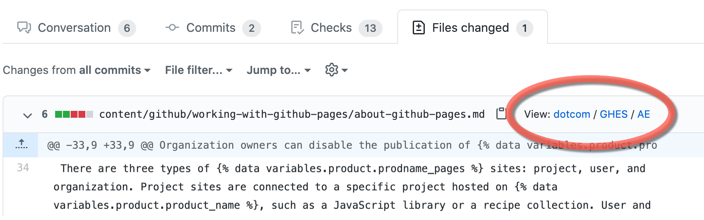

# bookmarklets
Productivity bookmarklets written in JavaScript 

## Add deployment links to PRs

This bookmarklet modifies the "Files changed" page of a pull request. For each markdown file, it adds links to the  staging deployment of the file. 

Three links are added: dotcom / GHES / AE



Some of these links may get you a "page not found" if that version of the page doesn't exist (there's no way to tell from the information on the "Files changed" page).

To install the bookmarklet:

1. Drag this link onto your browser's Bookmarks/Favorites toolbar: [PR links](null).
2. Right-click the bookmark and click **Edit** or **Properties** (depending on your browser).
3. Copy and paste the following into the **URL** or **Location** field:
   ```
   javascript:void function()%7Bfunction a(a,b,c)%7Bvar d%3Ddocument.createElement("A")%3Breturn d.innerHTML%3Db,d.href%3Dc,d.target%3D"_blank",a.appendChild(d),a%7Dvar b%3Ddocument.querySelector("main h1 strong a").innerHTML,c%3Ddocument.querySelector("h1.gh-header-title span ~ span").innerHTML%3Bc%3Dc.substring(1)%3Bvar d%3Ddocument.querySelector("span.head-ref").innerText%3Bd%3Dd.replace(/.*:/,""),d%3Dd.replace("/",""),"docs-internal"%3D%3D%3Db%26%26(d%3Dd.substring(0,9))%3Bvar e%3D"https://"%2Bb%2B"-"%2Bc%2B"--"%2Bd%2B".herokuapp.com/en/"%3Bconst f%3Ddocument.querySelectorAll("div.file-info")%3Bfor(var g,h%3D0%3Bh<f.length%3Bh%2B%2B)if(g%3Df%5Bh%5D.querySelector("a").title,0%3D%3D%3Dg.search("data/"))continue%3Belse%7Bvar j%3D/%5C.md%24/,k%3D0<%3Dg.search(j)%3Bif(k)%7Bconsole.log("link: "%2Bg),g%3Dg.replace(j,""),g%3Dg.replace(/%5Econtent/,""),g%3Dg.replace(/%5C/index/,"")%3Bvar l%3Ddocument.createElement("SPAN")%3Bl.style.fontFamily%3D"-apple-system,BlinkMacSystemFont,Segoe UI,Helvetica,Arial,sans-serif",l.innerHTML%3D"%26nbsp%3B View: ",l%3Da(l,"dotcom",e%2B"free-pro-team%40latest"%2Bg),l.innerHTML%2B%3D" / ",l%3Da(l,"GHES",e%2B"enterprise-server%40latest"%2Bg),l.innerHTML%2B%3D" / ",l%3Da(l,"AE",e%2B"github-ae%40latest"%2Bg),f%5Bh%5D.appendChild(l)%7D%7D%7D()%3B
   ```
4. Click **Save**.

To use the bookmarklet:

1. Go to a PR that has a current staging deployment. 
2. Go to the "Files changed" page. 
3. Click the bookmarklet on your toolbar. 
4. Click the appropriate link next to the file name. 
